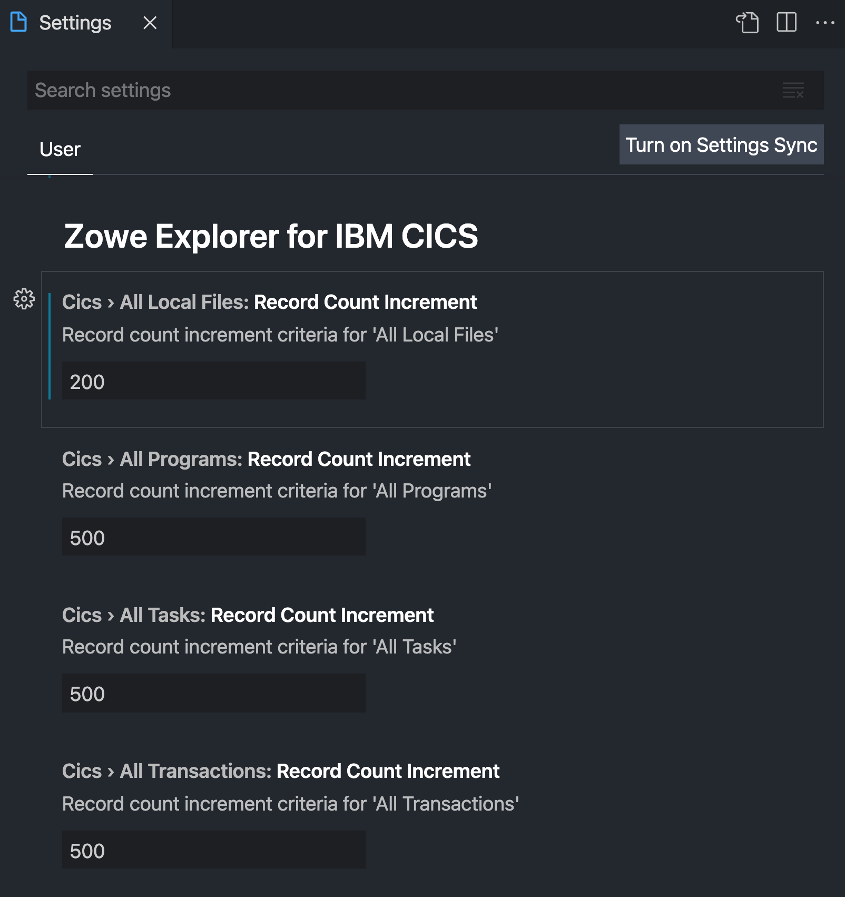
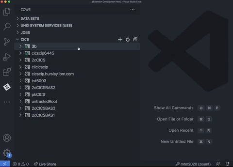
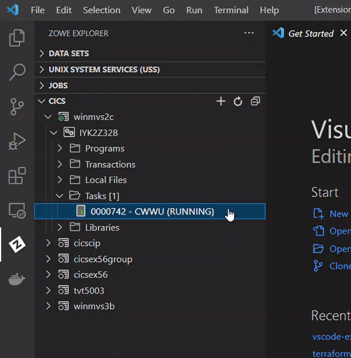
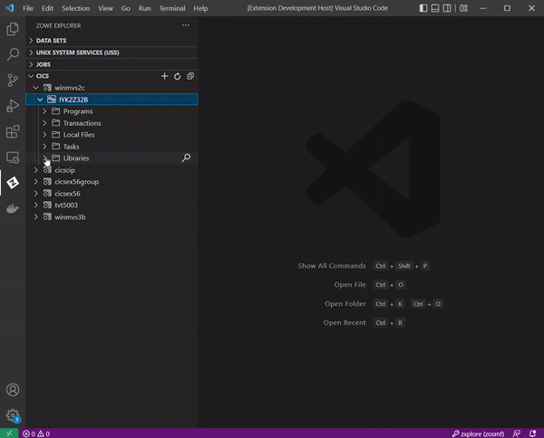
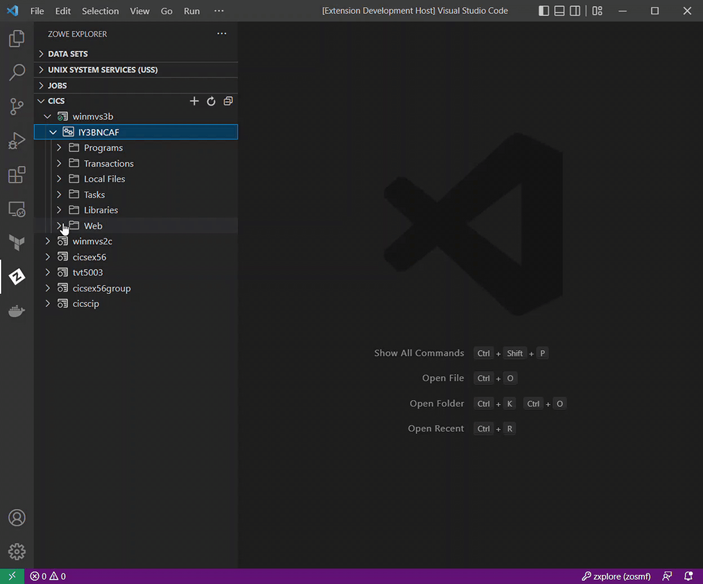

# Zowe CICS Explorer

[](https://vsmarketplacebadge.apphb.com/version-short/Zowe.cics-extension-for-zowe.svg)
[](https://vsmarketplacebadge.apphb.com/downloads-short/Zowe.cics-extension-for-zowe.svg)
[](https://openmainframeproject.slack.com/archives/CUVE37Z5F)
[](https://github.com/zowe/vscode-extension-for-cics/issues)

This CICS Extension for Zowe Explorer adds additional functionality to the popular VSCode extension, [Zowe Explorer](https://github.com/zowe/vscode-extension-for-zowe). This extension allows interactions with CICS regions and programs, and the ability to run commands against them.

## Contents

- [Software Requirements](#software-requirements)
- [Features](#features)
- [Getting Started](#getting-started)
  - [Create Profile](#create-profile)
  - [Update Profile](#update-profile)
  - [Hiding Profiles](#hiding-profiles)
  - [Deleting Profiles](#deleting-profiles)
- [CICS Resources](#cics-resources)
  - [Show and Filter Resources in a Region](#show-and-filter-resources-in-a-region)
  - [Show and Filter Resources in a Plex](#show-and-filter-resources-in-a-plex)
  - [Show and Filter Resources in an 'All' Resource Tree](#show-and-filter-resources-in-an-all-resource-tree)
  - [Show Attributes](#show-attributes)
  - [Enable and Disable](#enable-and-disable)
  - [New Copy and Phase In](#new-copy-and-phase-in)
  - [Open and Close Local Files](#open-and-close-local-files)
  - [Purge Task](#purge-task)
  - [Inquire Functionality](#inquire-functionality)
  - [View Datasets under Libraries](#view-datasets-under-libraries)
  - [View four CICS Web Resources under the Web Folder](#view-four-cics-web-resources-under-the-web-folder)
- [Untrusted TLS Certificates](#untrusted-tls-certificates)
- [Usage Tips](#usage-tips)
- [Providing feedback or help contributing](#providing-feedback-or-help-contributing)
  - [Checking the source of an error](#checking-the-source-of-an-error)
  - [Filing an issue](#filing-an-issue)

## Software Requirements

Ensure that you meet the following prerequisites before you use the extension:

- Install VSCode

- Install Zowe Explorer v2

**Tip**: See [Troubleshooting guide](./docs/Troubleshooting.md) for solutions to common problems.

## Features

- Load profiles directly from Zowe instance locally installed.
- Create new Zowe CICS profiles and connect to them.
- Work with multiple regions containing programs, local transactions and local files within a plex in a comprehensible tree-like format.
- Perform actions such as `Enable`, `Disable`, `New Copy` and `Phase In` directly from the UI.
- Perform additional actions on local files including `Open` and `Close` directly from the UI.
- Perform a `Purge` on Tasks with the option to select from a `Purge` or `Force Purge`.
- View and search attributes of resources and regions by right-clicking and using the dynamic filtering feature.
- Create new CICS profiles, update session details, and delete profiles using the user-friendly interface.
- Apply multiple filters to regions, programs, local transactions local files and/or tasks.
- View and interact with all resources under a plex.

To Install CICS Extension for Zowe Explorer see [Installation](./docs/installation-guide.md).

## Getting Started

### Create Profile

If you already have a Zowe CICS CLI profile, the CICS tree will load the default profile on startup.

If you don't have an existing Zowe CICS CLI profile, follow these steps to create one:

#### Using Zowe Team Configuration

1. Select the **+** button in the CICS tree.

2. Select the **Create New CICS profile** option to open your config file.

3. Edit the config file to add a CICS profile.

4. Refresh the Zowe Explorer for IBM CICS extension by either clicking the button at the top level of the CICS view, or the `Zowe Explorer for IBM CICS: Refresh` command palette option.

5. Select the **+** button in the CICS tree and click the newly created profile to load it into view.

<p align="center">
 
</p>

Here's an example of a CICS profile entry in the config file:

```
"profiles": {
   ...
   "cics_example": {
      "type": "cics",
      "properties": {
            "host": "replace-with-host-name",
            "port": replace-with-port-number,
            "rejectUnauthorized": true,
            "protocol": "http",
            "cicsPlex": "replace-with-plex-name",
            "regionName": "replace-with-region-name"
      }
   },
   ...
}
```

**Tip**: Create a profile without the "user" and "password" properties and expand the profile after loading it into the CICS view. The CICS extension will then prompt you for the "user" and "password" fields to be stored in the secure array.

#### Using Zowe v1 profiles

1. Select the **+** button in the CICS tree.

2. Select the **Create New CICS profile** option to open a panel that defines connection details.

**Note**: The connection must point to a CICS region's CICS Management Client Interface (CMCI) TCP/IP host name and port number. The region can be a WUI server in a CICSPlex, or else a stand-alone Single Management Application Programming (SMSS) region.

Configuring a CICS region to have a connection is a system programmer task and more details can be found in [Setting up CMCI with CICSPlex SM](https://www.ibm.com/docs/en/cics-ts/5.3?topic=explorer-setting-up-cmci-cicsplex-sm) or [Setting up CMCI in a stand-alone CICS region](https://www.ibm.com/docs/en/cics-ts/5.3?topic=suace-setting-up-cmci-in-stand-alone-cics-region). If your CMCI connection is configured to use a self-signed certificate that your PC's trust store doesn't recognize, see [Untrusted TLS certificates](#untrusted-tls-certificates).

<p align="center">
 
</p>

To show more than one CICS profiles in the tree, select the **+** button and choose from the list of profiles. Only profiles that not already included in the CICS tree will be shown.

#### Addtional details for making the connection

The connection must point to a CICS region's CICS Management Client Interface (CMCI) TCP/IP host name and port number. The region can be a WUI server in a CICSPlex, a stand-alone Single Management Application Programming (SMSS) region, or a CICS system group.

If neither of the fields under 'CICS Details' (for users using v1 profiles) or neither the 'cicsPlex' or 'regionName' properties (for users using team configuration) are specified, the profile will show all CICSPlex for the WUI server. Specify a Plex Name to just view data for a single CICSPlex.

For a CICSPlex, all managed regions will be shown unless you specify a specific region name. Instead of a region name, you may also enter a CICS System Group to allow scoping of resources within the CICSPlex.

For a stand-alone CICS region, the Region Name may be entered but is optional. Do not enter a CICSPlex name for a stand-alone CICS region.

Configuring a CICS region to have a connection is a system programmer task and more details can be found in [Setting up CMCI with CICSPlex SM](https://www.ibm.com/docs/en/cics-ts/5.3?topic=explorer-setting-up-cmci-cicsplex-sm) or
[Setting up CMCI in a stand-alone CICS region](https://www.ibm.com/docs/en/cics-ts/5.3?topic=suace-setting-up-cmci-in-stand-alone-cics-region). If your CMCI connection is configured to use a self-signed certificate that your PC's trust store doesn't recognize, see [Untrusted TLS certificates](#untrusted-tls-certificates)

To show more than one CICS profile in the tree, select the + button and choose from the list of profiles. Only profiles not already included in the CICS tree will be shown. To view all Zowe CICS CLI profiles use the command `zowe profiles list cics` from a terminal.

### Update Profile

#### Using Zowe Team Configuration

1. Right-click a profile to open up the profile menu actions.

2. Select the **Update Profile** button to open the config file.

3. Edit the config file to update the profile(s).

4. Refresh the Zowe Explorer for IBM CICS extension by either clicking the button at the top level of the CICS view, or the `Zowe Explorer for IBM CICS: Refresh` command palette option.

<p align="center">
 
</p>

#### Using Zowe v1 profiles

1. Right-click a profile to open up the profile menu actions.

2. Select the **Update Profile** button to update the session details.

   This will open a panel with fields containing the details that are used to create the connection. You can modify all fields apart from the **Profile Name**.

3. Once the details are updated, click the **Update Profile** button to apply the changes to the profile.

<p align="center">
 
</p>

### Hiding Profiles

Open the menu actions for a profile by right-clicking a profile and select `Hide Profile` to hide it from the CICS view. To add the profile back, click the + button and select the profile from the quick pick list.

<p align="center">
 
</p>

### Deleting Profiles

#### Using Zowe Team Configuration

1. Right-click a chosen profile.

2. Select **Delete Profile** which opens the config file.

3. Edit the config file to remove the cics profile entry.

4. Refresh the Zowe Explorer for IBM CICS extension by either clicking the button at the top level of the CICS view, or the `Zowe Explorer for IBM CICS: Refresh` command palette option.

<p align="center">
 
</p>

#### Using Zowe v1 profiles

1. Right-click a chosen profile.

2. Select **Delete Profile** and click the **Yes** button when prompted to confirm the action of permanently deleting the profile. The functionality deletes the CICS profile from the persistent storage directory `~/.zowe/profiles/cics`.

<p align="center">
 
</p>

## CICS Resources

Expand a CICS profile to see the region name, and expand the region to view its resources. If the CICS profile is connected to a CMAS region that is part of a CICSPlex, the tree will show all of the regions managed by the CICSPlex. If the CICS profile is for an SMSS region then just one region will be shown. Inactive regions in a plex are shown with an empty icon.

### Show and Filter Resources in a Region

Expand a CICS region to show folders for the resource types `Programs`, `Transactions`, `Local Files` and `Tasks`. Expand each type to show the resources. The number of resources in a resource tree will appear in square brackets next to the tree name.

The list of resources are pre-filtered to exclude many of the IBM supplied ones to narrow the contents to just include user programs. Use the search icon  against a resource type to apply a filter. This can be an exact resource name or else you can use wildcards. The search history is saved so you can recall previous searches.

To reset the filter to its initial criteria use the clear filter icon  against the resource type. If you wish to see all resources in a region (including IBM supplied ones) you can use "\*" as a filter.

<p align="center">
 
</p>

**Tip:** To apply multiple filters, separate entries with a comma. You can append any filter with an \*, which indicates wildcard searching.

### Show and Filter Resources in a Plex

Similar to filtering resources in a region, it is also possible to apply a filter on a all region resources in a plex. Use the search icon  inline with the `Regions` tree and then select either `Regions`, `Programs`, `Local Transactions` or `Local Files` from the drop-down menu to specify which resource type the filter should be applied to for all regions in the plex.

To reset the filter to its initial criteria use the clear filter icon  against the `Regions` tree. This will open a drop-down menu which gives the option to clear the filter for all the `Regions`, `Programs`, `Local Transactions` or `Local Files` in the plex, and an option to otherwise clear `All` filters within the plex.

<p align="center">
 
</p>

**Tip:** To apply multiple filters, separate entries with a comma. You can append any filter with an \*, which indicates wildcard searching.

### Show and Filter Resources in an 'All' Resource Tree

Plexes contain an `All Programs`, `All Local Transactions`, `All Local Files` and `All Tasks` trees which contain all the corresponding resources from all regions in the plex.

To view resources under these trees, use the search icon  inline with the tree and apply a filter.

<p align="center">
 
</p>

If the applied filter results in over 500 records, either change the filter to narrow down the search, or click the `view X more ...` item to retrieve 'X' more resources.

**Tip:** The default 500 count can be modified via the `Record Count Increment` property in Settings (UI).

<p align="center">
 
</p>

### Show Attributes

Right-click and use the pop-up menu against a program to list the available actions that can be performed. For every resource, including a CICS region, `Show Attributes` opens a viewer listing all attributes and their values. The attributes page has a filter box at the top that lets you search for attributes matching the criteria.

<p align="center">
 
</p>

### Enable and Disable

Right-click against a program, local transaction or local file to open up the pop-up menu and click `Disable [CICS resource]` to disable the resource. When a resource is already disabled the first option becomes `Enable [CICS resource]` to allow its enablement state to be toggled. A disabled resource is identified by a `(Disabled)` text next to its name.

<p align="center">
 
</p>

### New Copy and Phase In

Use `New Copy`  and `Phase In`  actions against a CICS program to get the CICS region to load a fresh of the selected program into memory. This could be after you've edited a COBOL program source and successfully compiled it into a load library and now want to test your change.

The `newcopycnt` for a program which is greater than zero is shown next to the program item in the CICS resource tree.

<p align="center">
 
</p>

### Open and Close Local Files

Right-click against a closed local file and perform the `Open Local File` menu action to toggle the `openstatus` attribute to 'OPEN'.

To close a local file, right-click against an open local file and perform the `Close Local File` menu action. This will bring up a prompt on the bottom right corner requesting to choose one of `Wait`, `No Wait` or `Force` for the file busy condition. Once an option has been selected, the local file name will be appended with a `(Closed)` label upon success.

<p align="center">
 
</p>

### Purge Task

Right-click against a task and click the `Purge Task` command. This will open a prompt asking whether to perform a `Purge` or `Force Purge`.

Select the appropriate condition to perform the purge.

<p align="center">
 
</p>

### Inquire Functionality

Right-click against a Task and perform the `Inquire Transaction` command. This will inquire the associated Local Transaction (i.e. the transaction with the name that matches the `tranid` attribute of the selected Task) under the Local Transactions folder.

The same can be done on a Local Transaction to find the associated Program by executing the `Inquire Program` right-click menu action against a Local Transaction.

<p align="center">
 
</p>

### View Datasets under Libraries

Expand libraries of a region to view specific datasets belonging to a library. Right-click on libraries to `Show Attributes` to view library attributes. Similarly, right-click on datasets to `Show Attributes` to view dataset attributes.

<p align="center">
 
</p>

### View four CICS Web Resources under the Web Folder

Expand the Web folder to view TCPIP Services, URI Maps, Pipelines and Web Services. Each of these resources can be expanded and allows for right-click functionality on the specific resource to execute the `Show Attributes` command. Use the search icon to filter down specific resources by applying a filter.

<p align="center">
 
</p>

## Untrusted TLS Certificates

If the CMCI connection is using a TLS certificate that your PC doesn't have in its trust store, then by default the connection will be rejected as potentially this could be from an unsafe site. To override this behavior, either set the `Only accept trusted TLS certificates` field on the form when creating/updating the profile to `False`. This is the same as setting `rejectUnauthorized=false` on the Zowe CICS CLI profile.

If you define a profile as only accepting trusted TLS certificates when the Zowe Explorer first connects it will detect the mismatch and allow you to override the setting and proceed. This is done through a pop-up message with a `Yes` button to accept the untrusted certificate authority, which changes the profile's setting.

<p align="center">
 
</p>

## Usage tips

- All menu action commands available via right-clicking a profile/resource (excluding `Show Attributes`) can be applied on multiple items by multi-selecting nodes of the same type before right-clicking and selecting the command.

  - To multi-select, either hold `Ctrl`/`Cmd` key while clicking resources, or select the first item in a list of nodes then hold `Shift` and click both the last item to select a consecutive list of nodes.

- Click the refresh icon  at the top of the CICS view to reload the resources in every region.

## Providing feedback or help contributing

### Checking the source of an error

Before filing an issue, check if an error is arising from the Zowe Explorer for IBM CICS extension and not the Zowe Explorer extension by expanding the error message and checking if the `Source` is `Zowe Explorer for IBM CICS (Extension)`.

<p align="center">
 
</p>

Error messages arising from the Zowe Explorer extension will have the `Source` as `Zowe Explorer(Extension)`.

### Filing an issue

Before filing an issue, check the [Troubleshooting guide](./docs/Troubleshooting.md) first to ensure that the issue hasn't already been addressed.

To file issues, use the [Zowe Explorer for IBM CICS issue list](https://github.com/zowe/vscode-extension-for-cics/issues), or chat with use on [Slack](https://openmainframeproject.slack.com/archives/CUVE37Z5F) by indicating the message is for the Zowe Explorer for IBM CICS extension.
